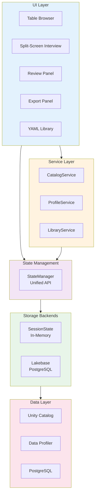
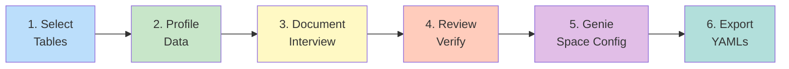

# Genify App

AI-powered Streamlit application that generates standardized table comments and Genie space metadata through intelligent, context-aware interviews.

---

## Quick Start

### 1. Install Dependencies

```bash
pip install -r requirements.txt
```

### 2. Configure Environment

#### For Databricks Apps Deployment

Most environment variables are [automatically provided](https://docs.databricks.com/aws/en/dev-tools/databricks-apps/system-env#default-environment-variables):
- ✅ `DATABRICKS_HOST` (auto-set)
- ✅ `DATABRICKS_CLIENT_ID` (auto-set)
- ✅ `DATABRICKS_CLIENT_SECRET` (auto-set)

You only need to configure the SQL Warehouse ID in `app.yaml`.

#### For Local Development

Create a `.env` file or export environment variables:

```bash
# Required for local dev
export DATABRICKS_HOST="your-workspace.cloud.databricks.com"
export DATABRICKS_WAREHOUSE_ID="your-warehouse-id"
export DATABRICKS_CLIENT_ID="your-service-principal-id"
export DATABRICKS_CLIENT_SECRET="your-service-principal-secret"

# Optional overrides
export LLM_ENDPOINT_NAME="databricks-dbrx-instruct"
export LAKEBASE_ENABLED="false"
```

### 3. Run the App

```bash
streamlit run app.py
```

---

## Architecture

Genify follows a clean layered architecture with graceful degradation:



### Key Components

**UI Layer** (`ui/`):
- Streamlit components for user interaction
- Delegates to services and state management
- No business logic

**Service Layer** (`state/services/`):
- `CatalogService`: Unity Catalog browsing with per-connection caching (via `get_catalog_service()`)
- `ProfileService`: Table profiling with session-state caching (via `get_profile_service()`)
- `LibraryService`: YAML library management with graceful degradation (via `get_library_service()`)
- `InterviewService`: Interview state management and coordination (via `get_interview_service()`)
- `ContextSummarizerService`: Context summarization with Gemini Flash (via `get_context_summarizer_service()`)

**All services use factory functions with session-state caching for optimal performance**

**State Management** (`state/`):
- `StateManager`: Unified API for all state operations
- `PersistenceService`: Session and YAML persistence
- Backend abstraction (in-memory or PostgreSQL)

**Data Layer** (`data/`):
- Unity Catalog queries via information_schema
- Data profiling with statistics and distributions
- UI-agnostic, pure functions

---

## Workflow



### Workflow Steps

1. **Select Tables**: Browse Unity Catalog (catalog → schema → table)
2. **Profile Data**: Automatic profiling with statistics, distributions, sample values
3. **Document Tables**: AI interview with pre-populated fields from profiling
4. **Review**: Verify and edit generated table comments
5. **Genie Space**: Configure space-specific query instructions
6. **Export**: Download individual YAMLs or bulk ZIP

---

## Features

### Core Features

- ✅ **Unity Catalog Integration**: Browse with privilege filtering
- ✅ **Automatic Data Profiling**: Row counts, distributions, date ranges, top values
- ✅ **AI-Powered Interviews**: Context-aware questions with pre-populated answers
- ✅ **Two-Tier Metadata**: Universal table comments + space-specific Genie metadata
- ✅ **Live YAML Preview**: See generated YAML update in real-time
- ✅ **Template Customization**: Bring your own metadata structure
- ✅ **Session Persistence**: Save and resume work across sessions

### Advanced Features

- ✅ **Multi-User Support**: Session isolation per user
- ✅ **YAML Library**: Reusable metadata library (requires PostgreSQL)
- ✅ **Bulk Export**: Download all YAMLs as ZIP
- ✅ **Inline Editing**: Edit generated YAMLs with validation
- ✅ **History Panel**: View and restore previous sessions
- ✅ **Graceful Degradation**: Core features work without database persistence

---

## Configuration

All settings are in `app.yaml`:

```yaml
# LLM Configuration
llm:
  endpoint_name: "databricks-dbrx-instruct"
  
# SQL Warehouse for Unity Catalog
resources:
  - name: default
    warehouse_id: "your-warehouse-id"
    
# Optional: Lakebase for persistence
lakebase:
  enabled: false
```

### Configuration Options

| Setting | Description | Default |
|---------|-------------|---------|
| `llm.endpoint_name` | LLM endpoint for interviews | databricks-dbrx-instruct |
| `resources[0].warehouse_id` | SQL Warehouse ID | Required |
| `lakebase.enabled` | Enable PostgreSQL persistence | false |

---

## Deployment

### Local Development

```bash
cd app
streamlit run app.py
```

### Databricks Apps

```bash
# Update app.yaml with your warehouse ID
vim app/app.yaml

# Deploy from repository root
databricks apps deploy \
  --source-path . \
  --app-name genify
```

See [DEPLOYMENT.md](DEPLOYMENT.md) for complete deployment guide.

---

## Directory Structure

```
app/
├── app.py                      # Main Streamlit app
├── app.yaml                    # Databricks Apps configuration
├── config.py                   # Configuration management
├── requirements.txt            # Python dependencies
│
├── auth/                       # Authentication
│   ├── service_principal.py    # Service principal auth
│   └── oauth_obo.py            # OAuth OBO (future)
│
├── data/                       # Data layer
│   ├── information_schema.py   # Unity Catalog queries
│   ├── profiler.py             # Data profiling
│   └── profile_formatter.py    # Format profiles for LLM
│
├── llm/                        # LLM integration
│   ├── client.py               # LLM clients + factory functions
│   │                           # - get_main_llm_client() → GPT-5.2
│   │                           # - get_summarizer_llm_client() → Gemini Flash
│   └── section_interview.py    # Section-based interview engine
│
├── state/                      # State management
│   ├── manager.py              # StateManager (unified API)
│   ├── persistence.py          # Session persistence
│   ├── context.py              # User session context
│   ├── models.py               # Data models
│   ├── backends/               # Storage backends
│   │   ├── base.py
│   │   ├── session.py          # In-memory backend
│   │   └── lakebase.py         # PostgreSQL backend
│   └── services/               # Atomic services
│       ├── catalog_service.py  # Unity Catalog browsing
│       ├── profile_service.py  # Table profiling
│       ├── library_service.py  # YAML library
│       ├── interview_service.py # Interview management
│       └── context_summarizer_service.py # Context summarization
│
├── templates/                  # YAML templates (customizable)
│   ├── table_comment/          # Tier 1 sections
│   │   ├── sections.yaml
│   │   ├── 00_skeleton.yml
│   │   ├── 01_core_description.yml
│   │   ├── 02_relationships.yml
│   │   ├── 03_data_quality.yml
│   │   └── 04_metadata.yml
│   ├── genie/                  # Tier 2 sections
│   │   ├── sections.yaml
│   │   ├── 01_sql_expressions.yml
│   │   ├── 02_query_instructions.yml
│   │   ├── 03_example_queries.yml
│   │   ├── 04_clarification_rules.yml
│   │   └── 05_space_context.yml
│   └── README.md
│
├── prompts/                    # LLM prompts
│   ├── interview_planning.md
│   ├── genie_interview_planning.md
│   ├── table_comment_sections/
│   └── genie_sections/
│
├── ui/                         # UI components
│   ├── table_browser.py
│   ├── split_screen_interview.py
│   ├── review_panel.py
│   ├── export_panel.py
│   ├── yaml_library_panel.py
│   ├── yaml_editor_page.py
│   ├── help_page.py
│   ├── components/
│   │   ├── header.py
│   │   └── history_panel.py
│   ├── styles/
│   │   ├── theme.py
│   │   ├── layout.py
│   │   └── components.py
│   └── utils/
│       ├── navigation.py
│       ├── availability.py      # Service availability checks
│       ├── cache.py             # UI caching utilities
│       └── lakebase.py          # Lakebase helpers
│
└── utils/                      # Utilities
    ├── decorators.py            # @require_lakebase, @log_errors
    ├── data_conversion.py       # Format conversion utilities
    └── yaml_utils.py            # YAML validation
```

---

## Customization

### Bring Your Own Templates

Customize metadata structure for your organization:

1. **Edit Section Templates**: Modify YAML files in `templates/table_comment/` and `templates/genie/`
2. **Update Section Registry**: Edit `sections.yaml` to add/remove sections
3. **Customize Prompts**: Modify prompts in `prompts/` directory
4. **Deploy**: Changes apply automatically on next deployment

See [templates/README.md](templates/README.md) for detailed customization guide.

---

## Development

### Adding a New Service

```python
# 1. Create service in state/services/
class MyService:
    def __init__(self, state_manager):
        self.state = state_manager
    
    def is_available(self):
        return True
    
    def my_operation(self):
        # Implementation
        pass

# 2. Add to state/services/__init__.py
from .my_service import MyService

def get_my_service(state_manager):
    return MyService(state_manager)

# 3. Use in UI components
from state.services import get_my_service

service = get_my_service(state)
if service.is_available():
    service.my_operation()
```

### Adding a New UI Component

```python
# ui/my_component.py
import streamlit as st
from state import get_state_manager

def render_my_component():
    state = get_state_manager()
    
    st.header("My Component")
    # Component logic
```

---

## Testing

### Manual Testing Checklist

#### Core Features (No Lakebase)
- [ ] Browse catalogs, schemas, tables
- [ ] Generate data profile
- [ ] Start table interview
- [ ] Answer questions and complete interview
- [ ] Review generated YAML
- [ ] Edit YAML inline
- [ ] Start Genie interview
- [ ] Complete Genie interview
- [ ] Export individual YAMLs
- [ ] Export bulk ZIP

#### Persistence Features (With Lakebase)
- [ ] Save session
- [ ] List saved sessions
- [ ] Restore session
- [ ] Rename session
- [ ] Delete session
- [ ] Save to library
- [ ] Browse library
- [ ] Search library
- [ ] Delete from library
- [ ] Edit library YAML

#### Graceful Degradation
- [ ] App works with Lakebase disabled
- [ ] Core features available
- [ ] Persistence features hidden
- [ ] No exceptions in logs
- [ ] Clear UI messages

---

## Troubleshooting

### Connection Issues

**Symptom**: Cannot connect to Databricks

**Solutions**:
- Verify `DATABRICKS_HOST` is set correctly
- Check `DATABRICKS_CLIENT_ID` and `DATABRICKS_CLIENT_SECRET`
- Ensure service principal has Unity Catalog permissions
- Verify SQL Warehouse is running

### LLM Errors

**Symptom**: Interview fails to start

**Solutions**:
- Check `endpoint_name` in `app.yaml`
- Verify endpoint is enabled in workspace
- Try default endpoint: `databricks-dbrx-instruct`
- Check Foundation Models API access

### No Tables Visible

**Symptom**: Empty table list in browser

**Solutions**:
- Check Unity Catalog permissions
- Verify service principal can read information_schema
- Try different catalog or schema
- Check SQL Warehouse is running

### Profiling Errors

**Symptom**: Profile generation fails

**Solutions**:
- Verify table has data
- Check column types are supported
- Reduce profile sample size (if very large table)
- Check logs for specific error

### Library Not Available

**Symptom**: "Library requires Lakebase" message

**Expected Behavior**: This is normal when:
- `LAKEBASE_ENABLED=false` in config
- Lakebase connection not configured
- Running in local development mode

**To Enable**: 
- Set `LAKEBASE_ENABLED=true`
- Configure Lakebase resource in Databricks Apps
- Or use in-memory mode (core features still work)

---

## References

- [Databricks Apps Documentation](https://docs.databricks.com/dev-tools/databricks-apps/)
- [Databricks Apps Cookbook](https://apps-cookbook.dev/)
- [Information Schema Reference](https://docs.databricks.com/sql/language-manual/sql-ref-information-schema)
- [Genie Best Practices](https://docs.databricks.com/genie/best-practices)
- [Foundation Models API](https://docs.databricks.com/machine-learning/foundation-models/)
- [Parent README](../README.md)
- [Architecture Documentation](../docs/architecture.md)
- [Two-Tier Approach](../docs/two_tier_approach.md)

---

## Support

For issues or questions:
1. Check [DEPLOYMENT.md](DEPLOYMENT.md) troubleshooting section
2. Review [architecture documentation](../docs/architecture.md)
3. Check application logs in Databricks Apps console
4. Verify environment configuration
